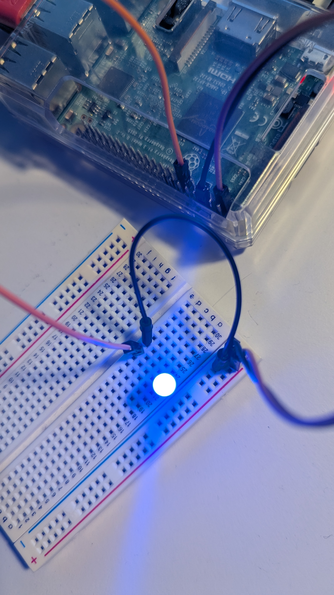

# 01_Anleitungen/Tag_04_Erste_LED.md

## 📅 Tag 4: Erste LED schalten 🔴

Hallo! Hast du schon dein tägliches Update geholt?
* **Terminal** -> `cd Desktop/Adventskalender_Pi_Tage` -> `git pull`

### 🎁 Inhalt des Türchens

* Eine **LED** (Leuchtdiode)
* Ein **Widerstand** (ein kleines Bauteil mit bunten Ringen)

### 🎯 Das Ziel des Tages

Heute wirst du zum ersten Mal ein Bauteil mit **Python-Code** steuern! Wir werden den Raspberry Pi anweisen, Strom an die LED zu schicken, damit sie leuchtet.

### 💡 Wichtig: Der Widerstand

Eine LED ist wie eine kleine Glühbirne, aber sie ist sehr empfindlich. Sie verträgt nicht die vollen 5 Volt (5V) von deinem Pi.

Der **Widerstand** ist wie eine Bremse für den Strom. Wir bauen ihn vor die LED, damit sie genau die richtige Menge Strom bekommt und nicht durchbrennt.

### 🔌 Schritte (Hardware)

**WICHTIG: Dein Pi muss ausgeschaltet sein, während du Kabel umsteckst!**

1.  **Pi herunterfahren:** Fahre deinen Pi herunter und ziehe das Stromkabel. (Die Kabel von Tag 3 zum Breadboard bleiben stecken).
2.  **Daten-Pin verbinden:**
    * Nimm ein **Jumper-Kabel** (z.B. ein gelbes).
    * Finde den Pin **GPIO 17** am Raspberry Pi (das ist Pin 11, siehe Diagramm). 
    * Stecke das eine Ende des Kabels auf **GPIO 17**.
    * Stecke das andere Ende in eine freie Reihe in der Mitte deines Breadboards (z.B. Reihe 10, Spalte E).
3.  **Widerstand einbauen:**
    * Stecke das eine Beinchen des **Widerstands** in dieselbe Reihe (Reihe 10, Spalte C).
    * Stecke das andere Beinchen in eine andere freie Reihe (z.B. Reihe 12, Spalte C).
4.  **LED einbauen:**
    * Schau dir die **LED** genau an: Sie hat ein **langes Beinchen (+)** und ein **kurzes Beinchen (-)**. Das ist wichtig!
    * Stecke das **lange Beinchen (+)** in dieselbe Reihe wie das zweite Beinchen des Widerstands (Reihe 12, Spalte E).
    * Stecke das **kurze Beinchen (-)** in die **blaue (GND / Minus) Schiene** an der Seite deines Breadboards.
5.  **Überprüfen!**
    * Dein Stromkreis sollte jetzt so fließen:
        Pi (GPIO 17) -> Jumper-Kabel -> Reihe 10 -> Widerstand -> Reihe 12 -> LED (langes Bein) -> LED (kurzes Bein) -> Blaue GND-Schiene -> Pi (GND-Pin)
    * So sieht der Aufbau aus:

### Raspi GPIO Belegung

### 💻 Schritte (Software)

1.  **Pi starten:** Schließe den Strom wieder an und starte den Pi.
2.  **Thonny IDE starten:** Klicke auf die Himbeere -> "Programmierung" -> "Thonny Python IDE".
3.  **Datei öffnen:**
    * Gehe auf "Datei" -> "Öffnen...".
    * Navigiere zu `Desktop/Adventskalender_Pi_Tage/Tag_04/`.
    * Öffne die Datei **`Tag_04.py`**.
4.  **Code ansehen:** Du siehst jetzt deinen ersten echten Steuer-Code!
5.  **Code ausführen:**
    * Klicke auf den **grünen Play-Button**.

### ✅ Erfolg!

Deine LED sollte jetzt für 10 Sekunden hell leuchten und danach wieder ausgehen (wenn `GPIO.cleanup()` ausgeführt wird). Du hast gerade Hardware mit Code gesteuert!

### 🧪 Experimentier-Zone!
Super! Die LED hat geleuchtet. Aber was kannst du jetzt damit machen?

Frage: Was passiert, wenn du die Zahl in time.sleep(10) änderst?

Versuche: Ändere sie auf time.sleep(1) (nur eine Sekunde) oder time.sleep(30) (eine halbe Minute).

Challenge: Was passiert, wenn du die Zeile GPIO.cleanup() mit einem # am Anfang auskommentierst (z.B. # GPIO.cleanup())? Bleibt die LED nach dem Programmende an? (Probiere es aus!)

Frage: Was passiert, wenn du GPIO.HIGH zu GPIO.LOW änderst? Leuchtet die LED überhaupt?